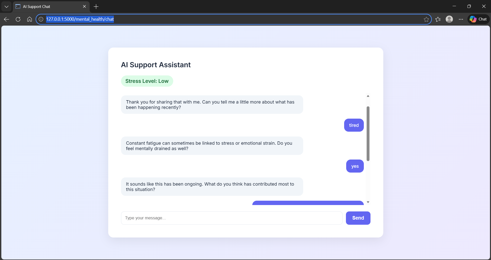

🧠 Mental Health Analysis Tool

A production-structured AI web application that performs NLP-based stress classification and provides a context-aware conversational support assistant.

Built with Python, Flask Blueprints, scikit-learn, and TF-IDF feature engineering, following modular software engineering principles.


🚀 Project Overview

This project integrates:

🧠 Mental Health Analyzer – ML-based stress classification system
🤖 AI Support Chatbot – Context-aware conversational assistant
🏗 Modular Architecture – Clean separation of ML, services, and routes

The system classifies user text into stress levels and adapts conversational responses based on emotional intensity and chat history.

🔎 Engineering Highlights

- Modular architecture using Flask Blueprints
- Clear separation of routes, services, ML logic, and training pipeline
- Versioned ML model storage
- Rotating log system for production readiness
- Config-driven environment setup
- Balanced dataset preprocessing pipeline
- Context-aware chatbot using conversation state management


🧩 Architecture

```
mentalhealthai/
│
├── mental_health/                # Flask Blueprint
│   ├── services/                 # Business logic layer
│   │   ├── stress_engine.py
│   │   ├── chatbot_engine.py
│   │   └── text_preprocessing.py
│   ├── templates/                # Jinja UI
│   ├── static/                   # CSS styling
│   ├── routes.py                 # Controller layer
│   └── __init__.py
│
├── models/mental_health/         # Trained ML models
│   ├── stress_model_*.pkl
│   └── metrics.json
│
├── train/                        # ML training pipeline
│   ├── prepare_stress_data.py
│   ├── train_stress_model.py
│   ├── data_utils.py
│   ├── evaluation_utils.py
│   └── model_utils.py
│
├── data/mental_health/           # Raw & processed datasets
├── logs/                         # Rotating logs
├── app.py                        # Application factory
├── config.py                     # Central configuration
└── requirements.txt

```

🔍 Features

1️⃣ NLP-Based Stress Classification

TF-IDF Vectorization
N-gram feature extraction (1–2 grams)
Logistic Regression classifier
Balanced training dataset
Model versioning with timestamp
Metrics exported to JSON

Stress levels:

Low
Moderate
High

2️⃣ Context-Aware AI Support Assistant

Uses chat history
Emotion keyword intensity detection
Escalation logic for high emotional signals
Professional help suggestions based on age group
Prevents repetitive responses
Progressive conversational flow

3️⃣ Modular Architecture

The project follows a layered design:
| Layer    | Responsibility                    |
| -------- | --------------------------------- |
| Routes   | HTTP request handling             |
| Services | ML + Chat logic                   |
| Train    | Data preparation + model training |
| Models   | Versioned ML artifacts            |
| UI       | Clean Jinja-based frontend        |

This ensures:

Scalability
Maintainability
Separation of concerns
Production readiness

📊 Model Performance

Latest Model Accuracy:

Accuracy: ~79%
Balanced multi-class classification

Evaluation includes:

Precision
Recall
F1-score
Stratified train-test split

Metrics stored in:
models/mental_health/metrics.json

🛠 Installation
1️⃣ Clone the repository
git clone <https://github.com/Deepti0806>
cd mentalhealthai

2️⃣ Create virtual environment
python -m venv venv
venv\Scripts\activate

3️⃣ Install dependencies
pip install -r requirements.txt

🧪 Train the Model (Optional)

If you want to retrain:

python train/prepare_stress_data.py
python train/train_stress_model.py


New model version will be saved under:

models/mental_health/

▶ Run the Application
python app.py


Access in browser:

http://127.0.0.1:5000/mental_health/

📈 Logging & Production Setup

Rotating file handler
Logs stored in /logs/app.log
Config-driven environment variables
No hardcoded paths
Clean blueprint registration

🔮 Future Improvements

Replace rule-based chatbot with LLM integration
Add REST API endpoints
Add Docker containerization
Deploy to AWS / Render / Railway
Add user authentication
Add database-backed chat history
Implement monitoring dashboard

🖥 Demo

Stress Classification Interface:
- User inputs emotional text
- Model predicts stress level (Low / Moderate / High)
- Confidence score displayed
- Chatbot adapts conversation dynamically



⚠ Disclaimer

This application is not a medical diagnostic tool.
Users experiencing severe distress should seek professional help immediately.
